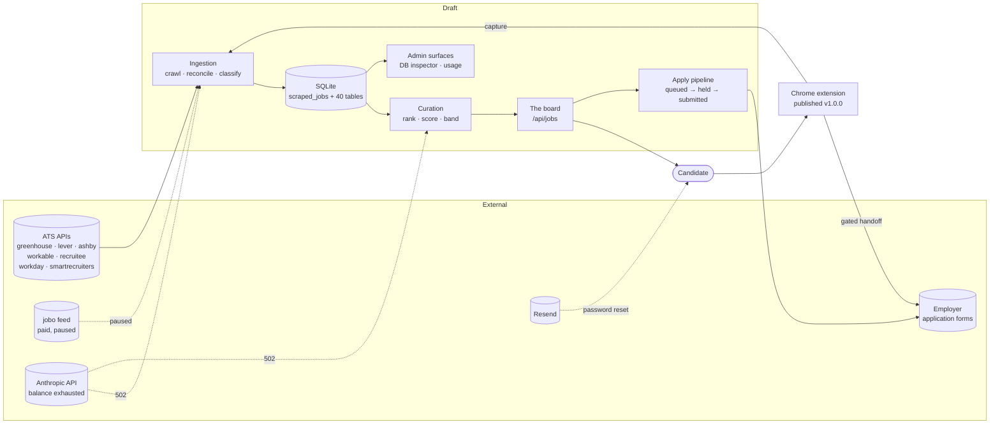
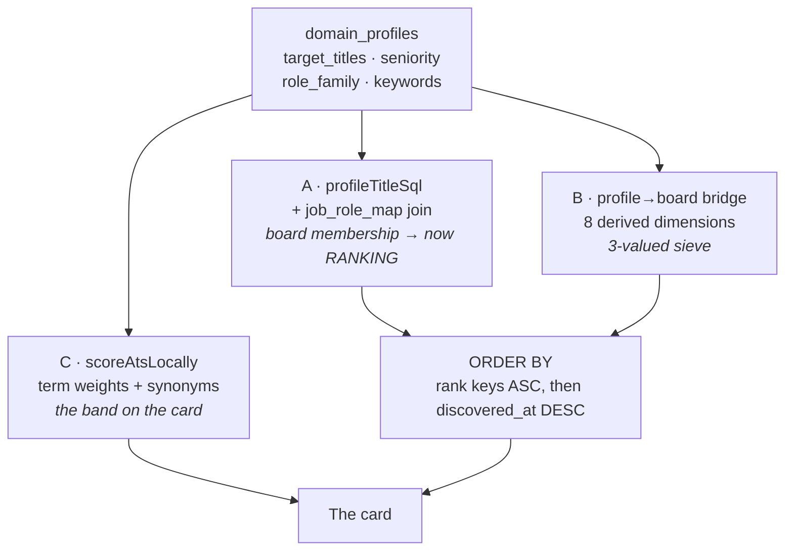
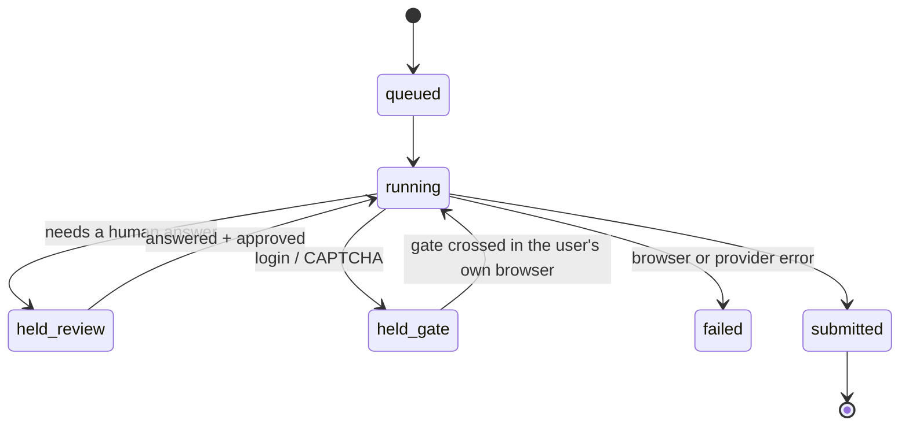
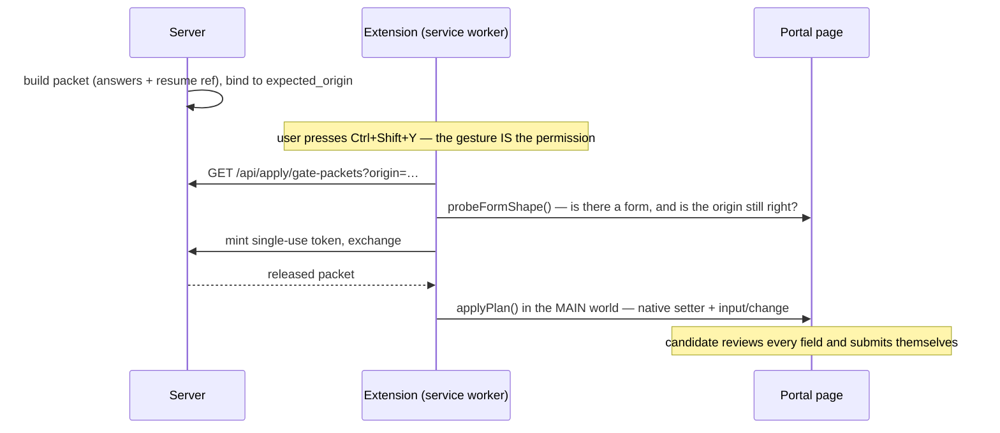
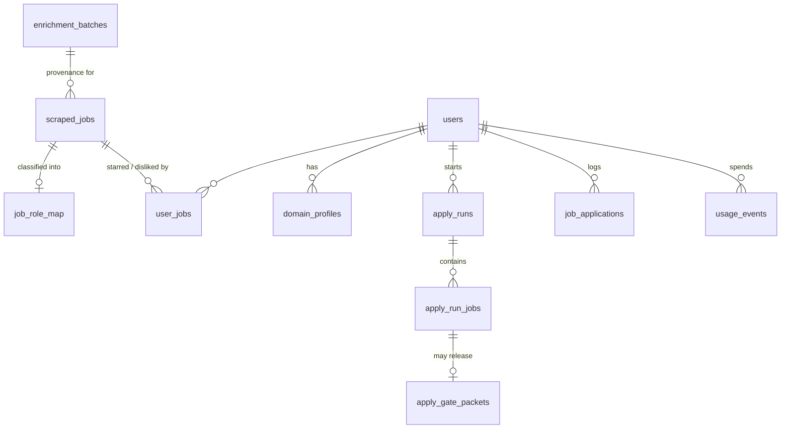

# Architecture

**Written from the code and the running system on 2026-09-24, against commit `4643e20`.** Every
figure below carries how it was measured. Nothing is carried forward from another document —
every number in the docs this replaces had been wrong at least once.

Two databases are referred to throughout and they are **not** interchangeable:

- **production** — the deployed board, measured through `GET /api/admin/db/raw-query` (SELECT-only,
  server-enforced). 2776 rows, 2662 active.
- **local** — `data/resume_master.db`, a snapshot **restored** from an evidence backup and frozen
  at `scraped_at = 2026-09-17`. 2460 rows, **all** active, because a restore never deactivated
  anything. It cannot be used to verify the expiry brake, and its coverage figures are its own.

⛔ **A 200 is not evidence.** `express.static` plus the SPA catch-all answer 200 with `index.html`
for any unknown path. Judge every probe by **response body and content-type**. That mistake has
produced a false finding four times.

---

## 0 · Context



The system crawls applicant-tracking systems directly, reconciles postings into one board, enriches
and scores them against a stored profile, and then either fills an application form or hands the
filled form to the candidate to review and submit. **Every dotted edge above is currently dead:**
the Anthropic balance is exhausted, so enrichment and import 502; the jobo feed is paused pending
credit.

---

## 1 · Ingestion

Seven ATS plugins are registered in `services/jobs/aggregator.js`, plus the jobo feed. **Five
produce rows.**

Measured across all 45 production crawl runs in `pipeline_runs`:

| source | runs | fetched | written | unchanged | discarded | discard rate |
|---|---:|---:|---:|---:|---:|---:|
| greenhouse | 45 | 54,521 | 5,071 | 33,225 | 16,225 | **29.8%** |
| ashby | 45 | 42,688 | 2,065 | 27,676 | 12,947 | **30.3%** |
| lever | 45 | 2,920 | 216 | 1,874 | 830 | **28.4%** |
| jobo | 45 | 280 | 134 | 0 | 146 | **52.1%** |
| workable | 45 | 459 | 12 | 91 | 356 | **77.6%** |
| recruitee | 45 | 253 | 8 | 62 | 183 | **72.3%** |
| workday | 45 | **0** | 0 | 0 | 0 | — |
| smartrecruiters | 45 | **0** | 0 | 0 | 0 | — |

⛔ **The discard rate is the largest unexamined number in the system.** Between a quarter and
three-quarters of everything fetched is dropped as unclassifiable before the board sees it —
roughly **30,000 postings** over these 45 runs. Nobody has inspected a sample of what is being
thrown away, so it is not known whether the classifier is correctly rejecting irrelevant work or
silently eating the board's best rows. This is the single cheapest high-value audit available.

`ejected` is a separate and much smaller count (blue-collar postings, deliberately removed).

**The two silent sources.** `workday` and `smartrecruiters` are scheduled and run daily, and every
run reports `status: "skipped_unconfigured"` with 0 fetched. They have therefore never contributed
a row. ⛔ **The boot log disagrees with the crawl:** `[JobAggregator] Active sources:` lists both,
because `isConfigured()` returns true at startup while the crawl reports them unconfigured. Two
notions of "configured" that do not meet — defect shape 1, in the place most likely to mislead
whoever next asks why the board is thin. *Owner 2026-09-24: could be both a config gap and a
wiring defect; not yet separated.*

**jobo** is a paid feed. Its credit expired and it is **deliberately paused** while testing
continues on free sources. *Owner confirmed 2026-09-24.* Its last run reports `failed`; that is the
paused state, not a regression.

**Reconciliation.** `reconcileFingerprint()` and `computeReqUid()` collapse the same posting seen
through different sources into one canonical row, under the priority **direct ATS > provider >
aggregator > import**. A row arriving from a lower tier merges into the canonical one rather than
duplicating it; `merged` in the table above counts those.

**Freshness.** Each source carries a watermark advanced only after a successful fetch *and* upsert,
so a failed crawl re-reads rather than skipping a window. Rows are pruned to `is_active = 0` by two
independent paths — expiry (`valid_through` passed) and staleness — reported separately in the run
record. Production holds 114 inactive rows; **the local snapshot holds none**, which is why the
brake cannot be verified locally.

---

## 2 · Enrichment

`enrichJob` selects candidates on `enriched_at IS NULL OR content_hash IS NULL OR updated_at >
enriched_at`, then **re-filters in JS on the exact content hash**. The SQL pre-filter alone is not a
cost basis: on the restored local board it matches 1252 rows where the hash check leaves 5, a 250×
over-count, because the restore stamped one bulk `updated_at` onto rows whose text never changed.

**It has been dead since 2026-09-17.** The most recent production run:

```
run_kind=enrichment  status=failed  fetched=25  written=0  failed=25
stopReason="no_progress"  remainingCandidates=1661
budget={maxRows:300, maxUsd:1, maxMinutes:20}
```

Every failure is the same 400 from Anthropic: *"Your credit balance is too low."* Re-probed free
on 2026-09-24 with `max_tokens:1` — still exhausted.

**Which columns actually come from enrichment.** This is the measurement that matters, and it
overturns the common assumption that enrichment fills the board:

| column | production | local | source |
|---|---:|---:|---|
| `normalized_title` | 100.0% | 100.0% | **ingestion** |
| `experience_level` | 100.0% | 100.0% | **ingestion** |
| `summary` | 99.9% | 99.9% | **ingestion** |
| `skills_json` | **41.0%** | **35.8%** | **enrichment — the only real gain** |
| `workplace_type` | 43.4% | 45.2% | mixed |
| `salary_min_usd` | 49.9% | 49.4% | mixed |
| `org_unit_raw` | 32.1% | 31.6% | mixed |
| `is_h1b_sponsor` | 0.3% | 0.1% | enrichment |

⛔ **`skills_json` is 41.0% in production and 35.8% locally.** Earlier docs claimed 99.8%; the
correction register then said 43.7%. Neither holds. Measure it, do not quote it.

**1559 production rows have never been enriched** — the unambiguous backlog. At Haiku list price
the whole backlog is roughly **$5.68**, so cost is not what is blocking it.

⛔ **Rewrites are invisible.** `columnsClimbed` counts only NULL→value transitions, so a value
*corrected in place* is reported as nothing at all — enrichment has been editing already-populated
fields while reporting only its fills. A prior audit put this at roughly 19–25 values per 10 rows,
mostly `summary` and `normalized_title`. ⚠ **That rate was NOT re-measured on 2026-09-24** and
cannot be while the balance is exhausted; treat it as the last known figure, not a current one.
What is certain from the code is the structural point: the counter cannot see a rewrite.
**Nobody has judged whether the rewrites are improvements.**

Writes follow two rules that exist because both were once violated: **COALESCE**, so a model
returning nothing cannot blank a good value, and **don't stamp on empty**, so a row that gained
nothing stays a candidate instead of being marked complete.

---

## 3 · Curation and scoring ⛔ the most important section

**Three systems decide one question — "is this job a good match?" — and they do not agree.**



**The board does rank — and it still does not rank by fit.** Both halves are true and the
distinction is the whole section.

It ranks: `buildOrderKeys()` prefixes the default sort with the derived rank keys, and
`appliedDerivedKeys` unconditionally includes `role_key` on any non-Saved board, plus
`target_title_exact` and `target_title_role` whenever the profile has target titles — which all 8
production profiles do (122–303 characters each). The client's initial sort is `dateDesc`, so the
prefix applies.

It does not rank by fit: each key is **three-valued** (`MATCH=0`, `UNKNOWN=1`, `MISS=2`), so the
result is a coarse sieve, not a score. **Measured: 700 active production rows tie at `MATCH` on
`role_key` alone** for an engineering profile, out of 2662. Within a tie the order is
`discovered_at DESC`. So what a candidate actually sees at the top of the board is *recency inside
a 700-deep band*. ⛔ And **any explicit sort removes ranking entirely** — choosing "Pay high to
low" drops the prefix, by design: a user instruction about order wins outright.

**Derived keys rank; they never exclude.** A value the *user* set filters rows out; a value derived
on their behalf only moves rows down, and `rank.demotedSql` counts how many were pushed down so the
UI can disclose it. That rule is structural — `appliedDerivedKeys` is carried into the query builder
rather than re-inferred, because the merged filter object looks identical either way.

**Agreement between the three, and what ρ supports.** The test suite asserts **ρ = 0.746** against
the owner's 30 human-graded postings, with **12.2% of pairs still mis-ordered**.
`CORRECTIONS_REGISTER.md` records a later reproduction at **ρ = 0.737**, and — more importantly —
that **26 of the 30 postings now score differently from the human key, max |delta| 40**. *Owner
2026-09-24: document both figures and the drift.* The drift is the finding: the corpus is the only
ground truth here and the engine has moved away from it while the headline ρ barely changed.

⛔ **What ρ ≈ 0.75 does not support** is ranking thousands of rows. It supports "the top of a short
list is roughly right". A full board implies exhaustiveness and invites judgement of ordering
across 2662 rows, which this correlation cannot carry.

**The graded corpus is irreplaceable.** `docs/am1-ats-graded-corpus.json` holds the 30 grades; the
original postings behind them were destroyed in the id-85 deletion. It cannot be rebuilt.

**`scraped_jobs.ats_score` is NULL on every row in both databases.** *Owner confirmed 2026-09-24:
by design.* CC5 made scoring per `(user_id, domain_profile_id, job_id)`, so a single global column
on a shared row cannot be correct. It is vestigial and scoring happens per request. See §9.

**Term weights.** Production carries 493 terms computed `2026-09-18 22:34` (local has 604 — a
different corpus). Refresh is due at 14 days, **2026-10-02**; scoring silently reverts to unweighted
with a `console.warn` at 45 days, **2026-11-02**. Earlier docs said 2026-10-13, which was correct
for the previous computation and is now stale.

---

## 4 · The apply pipeline



⛔ **Nothing has ever reached `submitted`.** Measured in production: **9 `apply_run_jobs` rows —
7 `held_review`, 1 `held_gate`, 1 `failed`, 0 `submitted`** — and **0 rows carry any submit
evidence** (`submit_verified` and `submit_evidence` are NULL on every row). Reason codes seen:
`resume_required` ×2, `manual_review` ×2, `captcha_required` ×2, `browser_error`,
`incomplete_form`, `provider_review_only`.

Earlier documents say "the pipeline has completed one real application". **That is wrong.** The
five `job_applications` rows are unrelated to the pipeline: four are `apply_mode: CUSTOM_SAMPLER`,
`source: LinkedIn`, logged in April 2026; one is `apply_mode: MANUAL`. None carries an
`auto_status` indicating an automated submission. *Owner 2026-09-24: recorded as measured; the
discrepancy was not previously known.*

⛔ **`apply_runs.status` carries two spellings** — `complete` (3 rows, April) and `completed`
(6 rows, August). A filter written against either silently misses the other set. *Owner 2026-09-24:
not previously known; recorded as a defect.* Chronological, so the newer spelling is presumably
canonical, but nothing enforces it.

**The integrity rules are architecture, not policy.** They are load-bearing and two of them exist
because they were violated in production:

- **No model call in the answer path.** Answers are resolved deterministically or not at all.
- **Flag, don't fabricate.** A field that cannot be resolved is reported, never guessed.
- **Eligibility fields resolve by exact handler mapping or not at all.** Work authorisation,
  sponsorship, clearance, visa, EEO and criminal history are attestations to an employer. Two live
  defects came from label matching getting clever near them: `login_email` matched the email
  handler and typed a home address into a sign-in box at 0.9 confidence, and a `work_authorization`
  key substring-matched a semantically **inverted** sponsorship question.
- **The company KB learns only from company-emitted data**, and holds companies and roles only —
  never individuals. ⚠ This one is recorded from the design brief and **was not verified against
  the code on 2026-09-24**; the other three were. Verify before relying on it.

⛔ **`semi` mode does not HOLD on the completeness or low-confidence gates** — both live inside
`if (isUnattended)`, so the human is the only thing that blocks a submission. That is a deliberate
product decision: semi's premise is that a person is looking at the form, so holding would defeat
the mode.

What it does do, since AE6: semi runs **the same discovery pass the gate uses, without the hold**,
and returns `missingRequired` and `openQuestions` in the shape the unattended hold emits. Before
that it performed no check at all and the review surface rendered a clean row over a form that
could not be submitted — *"not 'the gates are off in semi', which is defensible; the run declining
to report a fact it already had in hand"* (`services/applyAutomation.js`). Do not restate this as
"semi runs no gates"; the distinction is between not blocking and not reporting.

A semi run's audit row is still written **before** the human's edits happen, so it records what the
machine produced, not what was submitted.

---

## 5 · The gated handoff and the extension

**Why it exists:** some applications sit behind a login or CAPTCHA the server may not cross. The
candidate's own browser already holds that authenticated session. The extension borrows it for one
gesture, under `activeTab`, and fills the form the server prepared.



**The order is the security design.** Origin read → packet located by origin → form confirmed
present → *only then* is a token minted and spent. Every refusal happens before a token exists, so
a mismatch costs nothing. The packet is single-use and expires; a tab that closes clears it.

`applyPlan` writes through the prototype's **native setter** and then dispatches `input` and
`change`, because these portals track an input's value on the node itself and a plain assignment
leaves the framework believing nothing changed. The résumé is attached through a `DataTransfer` on
a real `input[type=file]` — and the attachment is confirmed by reading the page's own `files[0]`,
not by assuming the property took.

**The auth model, as fixed 2026-09-24.** The extension previously authenticated with
`credentials: 'include'` — the ambient browser cookie — so it acted as whatever session the browser
held. A measured probe from the extension origin reached **7 of 7 admin routes with real admin
JSON**. It now bootstraps `GET /api/auth/extension-token` once and sends only that token, with
`credentials: 'omit'` everywhere else; the server refuses admin routes to the extension regardless.
The popup names the identity it holds. Full account: `docs/EXTENSION_DIAGNOSIS.md` §6.

⛔ **There is no mobile analogue and there cannot be one.** The handoff depends on running inside
the browser that holds the portal session. This is the constraint that shapes both mobile apps: a
phone can review and queue, but the gate crossing has to happen somewhere a browser extension can
reach.

**Still open** (`docs/EXTENSION_DIAGNOSIS.md`): dead routes `/resume` and `/ats-score`, a
non-retryable billing error worded as retryable, and no read-back verification after a field is
filled.

---

## 6 · Data model



| table | production rows | what it is |
|---|---:|---|
| `scraped_jobs` | 2776 (2662 active) | the global posting pool; **shared**, not per-user |
| `job_role_map` | 2782 | role classification; the board's join. ~6 orphans |
| `user_jobs` | 17 | per-user star / dislike / applied |
| `domain_profiles` | 8 | the profile the board ranks against |
| `apply_runs` / `apply_run_jobs` | 9 / 9 | the pipeline's state machine |
| `job_applications` | 5 | **manual** application log — not the pipeline |
| `usage_events` | 1971 | every model call, success or failure |
| `enrichment_batches` | 46 | batch provenance, enabling revert |
| `skill_synonyms` | 218 | 196 proposed, 12 confirmed, 10 rejected |
| `ats_term_weights` | 493 | corpus-derived scoring weights |

**`scraped_jobs` is shared across users.** Anything user-specific belongs in `user_jobs` or a
profile-scoped table — which is exactly why the global `ats_score` column is vestigial (§3).

**Migrations are additive-only, dual-path and transactional.** The same list exists in
`scripts/migrations.js` and in `server.js`'s `MIGRATIONS` array, and tests assert the blocks are
**byte-identical** between them. ⛔ `server.js` is the runner that actually executes in production —
a migration added only to `scripts/migrations.js` never runs. Each migration and its bookkeeping row
commit in **one transaction**, so a half-applied migration cannot be recorded as done.

Production has applied **116**: the **110** numbered migrations both runners define, plus **6**
unnumbered legacy ids predating the `NNN_` convention (`admin_cache_events`, `admin_scrape_events`,
`admin_usage_events`, `admin_user_limits`, `ats_only_reports`, `contact_messages`). **Zero defined
migrations are unapplied.** High-water: `109_restore_stripped_seniority_titles`.

⛔ These two files are checked out **CRLF** and the byte-identity tests depend on it. Never rewrite
either whole-file — see `CLAUDE.md`.

---

## 7 · Auth and identity

**Three credentials, deliberately separate.**

| credential | scope | lifetime | revoked by |
|---|---|---|---|
| `connect.sid` | one browser profile, **host-only** | 7-day rolling | sign-out, password change |
| auth-context token | **one tab** (sessionStorage) | 7-day idle, 90-day absolute | sign-out sweeps the whole browser |
| extension token | the extension, `sessionLess` | same sliding window | `POST /api/auth/revoke-extension-token` |
| mobile token | one device, `sessionLess` | same | `POST /api/auth/revoke-mobile-token` |

**Why the last two are separate endpoints:** both revokes key on `user_agent`, so a shared endpoint
would mean "sign out my phone" also killing the extension. Two independent credentials must be
independently revocable. The wire values (`resume-master-extension`, `resume-master-mobile`) are
pinned in `shared/brand.js` — ⛔ renaming either orphans every live row and revoke silently stops
revoking.

`sessionLess: true` stores `session_sid NULL`, which `revokeBrowserAuthContexts()` deliberately
never sweeps — that is what lets the extension survive a browser sign-out on purpose.

**The cookie is host-only.** No `domain` is set, so a session on `jobsviadraft.com` is not sent to
`resumemaster.one`. Since `GOOGLE_CALLBACK_URL` already points at the new domain, a Google sign-in
started on the old origin lands its cookie on the new one — a live hazard for the installed
extension, which only knows the old origin (§10).

**Admin gating.** `mayActAsAdmin()` in `shared/authPolicy.js` is the single predicate, consulted by
all three `requireAdmin` definitions (`server.js`, `routes/admin.js`, `routes/adminDb.js`). Three
independent copies is how the extension reached the DB inspector while a fix sat in one of them.
⛔ **The extension is never an admin**, whoever holds it — refused on the *kind* of credential,
because `bindAuthContext` hydrates the full user and an admin's extension token would otherwise
satisfy `isAdmin`.

---

## 8 · Cost and model calls

**`callModel()` in `services/modelCall.js` is the single path.** It requires a `purpose` (so spend
is attributable to a feature) and a pinned `model`, records every call in `usage_events` **including
failures**, and routes by data class.

⛔ **Routing is by PAYLOAD, never by call-site name.** `purpose: "classifier"` sends 2000 characters
of résumé; `classify_job` does not. The class is declared per site:

- **PUBLIC** — job advert text a company published about itself: `enrich_job`, `classify_job`,
  `import_job`. Eligible for a free provider.
- **CANDIDATE** — anything derived from a person. Stays on Anthropic.
- **TOKENIZED** — a structured payload asserted field-by-field against `shared/piiPolicy.js` before
  anything is sent. ⛔ It **refuses**, it does not sanitise: dropping an offending field would mean
  the send succeeds and nobody learns the payload was wrong.

⛔ **The default is CANDIDATE.** A site that declares nothing stays on Anthropic. Forgetting to
annotate a public site costs a fraction of a cent; forgetting to annotate a résumé-touching one
would route a home address and work authorisation to a free tier.

**PUBLIC traffic is currently on Anthropic anyway.** Free-tier routing requires `ENRICH_PROVIDER`,
which is unset, so `resolveProvider()` returns `not_configured` and falls back — silently, by
design, since unconfigured is an honest default.

**The A2 verdict stands: enrichment stays on Haiku.** Groq measured **30.5% Jaccard on
`skillsHard`** and 17.4% on `skillsSoft` against Anthropic (`docs/am3-provider-verdict.md:183`) —
the column that feeds both `company_technographics` and the ATS scorer. Routing public traffic
there to dodge a billing problem trades a loud failure for a quiet data-quality one.

**Spend, measured.** 1971 production `usage_events`; locally 1663, of which `enrich_job` is 1551
(1519 successful). ⛔ **Zero rows carry `ats_score_before` / `ats_score_after`** in either database,
though AK1 built the `onTracked` callback to populate them. *Intent could not be established from
the code; recorded as unresolved.* Nothing therefore connects model spend to score movement.

---

## 9 · Built and not reachable

A section this project specifically needs, because "built but dormant" and "broken" look identical
from the code.

| item | state | classification |
|---|---|---|
| **Recruiter surface** | `RecruiterPanel` is an unconditional tab (`App.jsx:288`) and renders | **Reachable but unfinished.** *Owner 2026-09-24: a prospective project intended for future completion.* Earlier docs called it deliberately front-door-less; that is stale |
| **`skill_synonyms`** | 196 `proposed`, 12 `confirmed`, 10 `rejected` | *Owner 2026-09-24: the proposals **need improving and are not a finished product** — not a stuck review queue* |
| **`workday`, `smartrecruiters`** | scheduled, `skipped_unconfigured`, 0 fetched in 45 runs | Not configured, and the boot log contradicts the crawl. *Owner: could be both a config gap and a wiring defect* |
| **jobo** | credit expired, last run `failed` | **Deliberately paused** pending credit while testing continues on free sources. *Owner confirmed 2026-09-24* |
| **`scraped_jobs.ats_score`** | NULL on all 2776 / 2460 rows | **Vestigial by design** — CC5 moved scoring to per (user, profile, job). *Owner confirmed 2026-09-24* |
| **`usage_events.ats_score_before/after`** | 0 of 1971 populated | Callback built, nothing passes the values. **Unresolved** |
| **`users.form_schema_capture`** | column exists, defaults 0, **no UI anywhere in `client/src`** | Consent toggle with no consent surface. Blocks learning from user corrections |
| **Monetisation surfaces** | `monetisationEnabled: false` | Deliberate lever; Plans/Pricing hidden |
| **The apply pipeline's `submitted` state** | never reached, 9 attempts | Built, exercised, never completed (§4) |

---

## 10 · Known constraints and deadlines

- ⛔ **The Anthropic balance is exhausted.** Every model-backed path returns 502: enrichment,
  `/api/import/job` (so extension capture fails whole — it has **no deterministic fallback** and
  cannot degrade to title-plus-URL), résumé generation, cover letters. This is a **design
  constraint**, not only a defect: capture was built to require a model call, so an unfunded
  balance takes the feature to zero rather than to a degraded mode.
- **Term weights refresh 2026-10-02**, and scoring silently reverts to unweighted at
  **2026-11-02**, with only a `console.warn`.
- **Railway allows two custom domains** and both slots are in use, so `www.jobsviadraft.com` is in
  DNS but not activated. ⛔ `host_permissions` is a match pattern — `https://jobsviadraft.com/*`
  does not match a `www` host, so any path that emits `www` breaks the extension's fetch.
- **The published extension still points at `resumemaster.one`.** Both origins serve one app and
  ⛔ **there must be no 301 on the old origin** while that build is live — its fetches are
  credentialed and do not follow redirects, so a redirect fails silently rather than working. Safe
  only once the updated extension is **live in the store**, not merely submitted.
- **Two mailboxes may not exist:** `privacy@jobsviadraft.com` (published in the privacy policy a
  Web Store reviewer will read) and `noreply@jobsviadraft.com` (whose domain must be verified with
  Resend or password-reset sends fail).
- **The graded corpus cannot be rebuilt.** `docs/am1-ats-graded-corpus.json` is 30 human grades
  whose original postings were destroyed.
- **The local database is a restored snapshot**, frozen at 2026-09-17 with zero inactive rows. Do
  not measure the expiry brake, or production coverage, against it.
